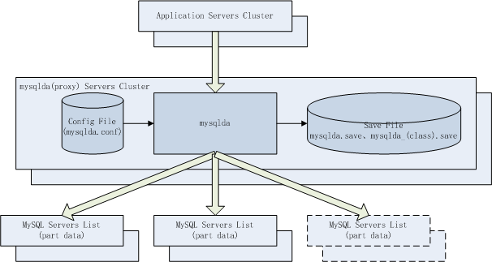
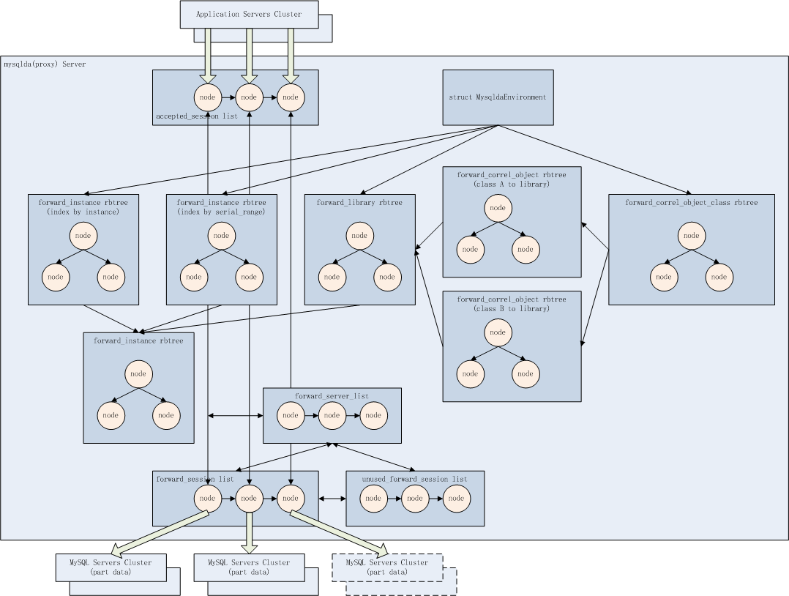

mysqlda - MySQL数据库中间件
==========================

<!-- TOC -->

- [1. 概述](#1-概述)
    - [1.1. 数据分布式切分方式](#11-数据分布式切分方式)
    - [1.2. mysqlda](#12-mysqlda)
- [2. 架构与原理](#2-架构与原理)
    - [2.1. 体系架构](#21-体系架构)
    - [2.2. 工作原理](#22-工作原理)
    - [2.3. 内部数据实体和关系](#23-内部数据实体和关系)
- [3. 安装部署](#3-安装部署)
    - [3.1. 解开mysqlda源码包 或 直接从源码托管地址克隆最新版](#31-解开mysqlda源码包-或-直接从源码托管地址克隆最新版)
    - [3.2. 进入src目录，清理中间文件](#32-进入src目录，清理中间文件)
    - [3.3. 编译](#33-编译)
    - [3.4. 安装目标文件到缺省目标目录](#34-安装目标文件到缺省目标目录)
- [4. 配置使用](#4-配置使用)
    - [4.1. 自动生成缺省配置文件](#41-自动生成缺省配置文件)
    - [4.2. 启动mysqlda](#42-启动mysqlda)
    - [4.3. 停止mysqlda](#43-停止mysqlda)
    - [4.4. 扩容MySQL数据库集群](#44-扩容mysql数据库集群)
        - [4.4.1. 增加MySQL归属库](#441-增加mysql归属库)
        - [4.4.2. 调整MySQL归属库服务器列表](#442-调整mysql归属库服务器列表)
- [5. 保存文件输出格式](#5-保存文件输出格式)
    - [5.1. 核心业务对象-MySQL归属库 保存文件格式](#51-核心业务对象-mysql归属库-保存文件格式)
    - [5.2. 关联对象类、关联对象-核心业务对象 保存文件格式](#52-关联对象类、关联对象-核心业务对象-保存文件格式)
- [6. 开发接口](#6-开发接口)
    - [6.1. 用核心业务对象选择MySQL归属库](#61-用核心业务对象选择mysql归属库)
    - [6.2. 用关联对象类、关联对象绑定到核心业务对象](#62-用关联对象类、关联对象绑定到核心业务对象)
    - [6.3. 用关联对象类、关联对象选择MySQL归属库](#63-用关联对象类、关联对象选择mysql归属库)
- [7. 其它注意事项](#7-其它注意事项)
- [8. 最后](#8-最后)
    - [8.1. 后续研发](#81-后续研发)
    - [8.2. 源码托管](#82-源码托管)
    - [8.3. 作者邮箱](#83-作者邮箱)

<!-- /TOC -->

# 1. 概述

## 1.1. 数据分布式切分方式

分布式架构中最难解决的是数据分布式问题，大部分数据库中间件都**以分库分表作为切分方式**，好处是通用，但也存在以下问题：

1. 扩容过程需要以切片为单位在库间移动数据。扩容规模受到切片数量限制，如果业务发展增长规模大大超出初期预估会导致切片数量不够用，陷入数据硬迁移的困境。
2. 同一业务对象的数据分散在不同库中，无法做聚合、连接等复杂处理。
3. 跨库意味着分布式事务，虽然现在有两阶段提交等解决方案，但理论上并不总是那么可靠，尤其是在金融行业苛求数据强一致性。

**以核心业务对象切分方式**则以产品线入口业务对象作为切分目标（比如互联网业务系统中的客户对象），开户交易途径数据库中间件，以手机号或其它入口字段作为核心字段做附带权重的客群切分，归属到数据库集群中的某个库中，并保存分配结果，以后该客户的所有交易都会被发往其归属库处理。当需要库存储扩容时，只需简单的增加库到数据库集群中，在数据库中间件系统中增加新库配置信息，并调大新库被分配权重，新客户分配归属到新库的概率变大，当新库存储增长到一定程度时调平分配权重，新客户分配归属到所有库的概率均等，直到下一次扩容。

以核心业务对象切分方式的好处是：

1. 无需预估切片，其扩容过程无需移动任何数据。
2. 由于同一业务对象的数据集中在其归属库中，所以可以进行任意聚合、连接等复杂处理。
3. 每个库都是全业务库，同一业务对象的所有模块处理都在一个库中完成，不存在跨库分布式事务，数据强一致性丢还给数据库单库来保证。

但也存在以下硬伤：

1. 产品线设计初期慎重挑选核心业务对象作为切分依据，后期很难变更。
2. 有些业务系统存在多个核心业务对象，不适合使用这种切分方式，如银行线上线下整合核心。

**以分库分表切分**和**以核心业务对象切分**是两种主流的数据分布式设计范式，各有优缺点，应在不同场景挑选合适的方式。

## 1.2. mysqlda

mysqlda是一款基于核心业务对象切分的Proxy模式的MySQL数据库中间件。

mysqlda优势：

* 以核心业务对象切分方式的所有好处。
* 单体系统的数据分布式改造过程尽量无感
* 支持以核心业务对象查询MySQL归属库（如开户用手机号或邮箱），也支持核心业务对象的关联对象（如开户后的用户ID、用户名、账号）查询MySQL归属库。
* 归属库分配权重自动调整，扩容后新库与老库的分配权重也自动调整，无需人工介入，使得所有库的数据量尽量自动均衡增长。
* 核心业务对象切分的库支持MySQL服务器优先列表，提高系统可用性。
* 与MySQL服务器之间连接池机制实现连接复用和闲置清理，提高连接和切换效率。
* 通过在线重载配置文件，扩容调整MySQL服务器优先列表、新增MySQL归属库完全无感。

# 2. 架构与原理

## 2.1. 体系架构



mysqlda数据库中间件完全遵循MySQL通讯协议桥接应用服务器集群和MySQL数据库集群。

mysqlda内部进程结构为“父-单子进程”。

## 2.2. 工作原理

MySQL数据库集群预创建相同的连接用户名、密码，相同的数据库名和应用表结构，mysqlda预创建相同的连接用户名、密码。

启动mysqlda集群，从配置文件（etc/mysqlda.conf）中装载连接用户名、密码，从保存文件（etc/mysqlda.save、etc/mysqlda.关联对象类.save）中装载已存在的核心业务对象、关联对象 与 MySQL数据库集群库 归属库关系信息。

应用服务器调用标准MySQL连接函数/方法连接mysqlda，mysqlda会遵循MySQL通讯协议处理MySQL用户登录和密码校验。

登录成功后，所有DML操作前，应用服务器发送mysqlda扩展SQL选择**核心业务对象**（"select library 核心业务对象"）或**关联对象类**、**关联对象**（"select library_by_correl_object 关联对象类 关联对象"）以连接MySQL归属库，mysqlda会查询其已分配的MySQL库**核心业务对象**或**关联对象类**、**关联对象**（如果没有分配过则根据加权一致性哈希算法分配一个归属库并持久化到保存文件中），从该MySQL归属库对应数据库服务器有序列表中选择一个服务器及其连接池中选取空闲连接（如没有缓存连接则新建一条连接），然后桥接对外和对内连接结对，开始处理后续所有DML操作。

后续DML操作中可以也发送mysqlda扩展SQL再选择**核心业务对象**或**关联对象类、关联对象**以调整MySQL归属库服务器连接。

MySQL归属库对应一个数据库服务器列表，如由MySQL数据库1A(MASTER)、1B(SLAVE)、1C(SLAVE)、1D(SLAVE)组成，1A同步复制数据给1B、1C和1D，如果1A出现故障不能被mysqlda连接，mysqlda会依次尝试连接1B、1C和1D，实现系统可用性。

应用服务器发送mysqlda扩展SQL绑定**关联对象类**和**关联对象**和**核心业务对象**（"set correl_object 关联对象类 关联对象 核心业务对象"），mysqlda会保存该关系并持久化到保存文件中，供以后直接用**关联对象类**、**关联对象**定位MySQL归属库。

## 2.3. 内部数据实体和关系



一个**MySQL归属库**（forward\_instance）对应一个**MySQL数据库服务器有序列表**（forward\_servers list）。

一个**MySQL数据库服务器有序列表**（forward\_servers list）下辖一个**空闲连接池**（unused\_forward\_session list）和一个**工作连接池**（forward\_session list）。

一个**核心业务对象**可以对应一个或多个**关联对象类**（forward\_correl\_object\_class）、**关联对象**（forward\_correl\_object）。

一个**核心业务对象**或一个**关联对象类、关联对象** 与 **MySQL归属库** 建立一个**归属关系**（forward\_library）。

accepted\_session是**应用服务器与mysqlda之间的通讯会话**，forward\_session是**mysqlda与MySQL数据库服务器之间的通讯会话**，一旦一条连接上的MySQL归属库被选定或切换，这两个会话会被桥接起来。

# 3. 安装部署

mysqlda只依赖于mysql或mariadb，必须先安装好开发包*-devel-*。

## 3.1. 解开mysqlda源码包 或 直接从源码托管地址克隆最新版

```Shell
$ git clone http://git.oschina.net/calvinwilliams/mysqlda
Cloning into 'mysqlda'...
remote: Counting objects: 355, done.
remote: Compressing objects: 100% (345/345), done.
remote: Total 355 (delta 221), reused 0 (delta 0)
Receiving objects: 100% (355/355), 586.04 KiB | 0 bytes/s, done.
Resolving deltas: 100% (221/221), done.
```

## 3.2. 进入src目录，清理中间文件

```Shell
$ cd mysqlda/src
$ make -f makefile.Linux clean
make[1]: Entering directory `/home/calvin/src/tmp/mysqlda/src/mysqlda'
rm -f lk_list.o
rm -f rbtree.o
rm -f LOGC.o
rm -f fasterjson.o
rm -f util.o
rm -f rbtree_ins.o
rm -f IDL_mysqlda_conf.dsc.o
rm -f main.o
rm -f config.o
rm -f monitor.o
rm -f worker.o
rm -f comm.o
rm -f app.o
rm -f mysqlda
make[1]: Leaving directory `/home/calvin/src/tmp/mysqlda/src/mysqlda'
```

## 3.3. 编译

```Shell
$ make -f makefile.Linux 
make[1]: Entering directory `/home/calvin/src/tmp/mysqlda/src/mysqlda'
gcc -g -fPIC -O2 -Wall -Werror -fno-strict-aliasing -I. -I/home/calvin/include -std=gnu99 -I/usr/include/mysql  -c lk_list.c
gcc -g -fPIC -O2 -Wall -Werror -fno-strict-aliasing -I. -I/home/calvin/include -std=gnu99 -I/usr/include/mysql  -c rbtree.c
gcc -g -fPIC -O2 -Wall -Werror -fno-strict-aliasing -I. -I/home/calvin/include -std=gnu99 -I/usr/include/mysql  -c LOGC.c
gcc -g -fPIC -O2 -Wall -Werror -fno-strict-aliasing -I. -I/home/calvin/include -std=gnu99 -I/usr/include/mysql  -c fasterjson.c
gcc -g -fPIC -O2 -Wall -Werror -fno-strict-aliasing -I. -I/home/calvin/include -std=gnu99 -I/usr/include/mysql  -c util.c
gcc -g -fPIC -O2 -Wall -Werror -fno-strict-aliasing -I. -I/home/calvin/include -std=gnu99 -I/usr/include/mysql  -c rbtree_ins.c
gcc -g -fPIC -O2 -Wall -Werror -fno-strict-aliasing -I. -I/home/calvin/include -std=gnu99 -I/usr/include/mysql  -c IDL_mysqlda_conf.dsc.c
gcc -g -fPIC -O2 -Wall -Werror -fno-strict-aliasing -I. -I/home/calvin/include -std=gnu99 -I/usr/include/mysql  -c main.c
gcc -g -fPIC -O2 -Wall -Werror -fno-strict-aliasing -I. -I/home/calvin/include -std=gnu99 -I/usr/include/mysql  -c config.c
gcc -g -fPIC -O2 -Wall -Werror -fno-strict-aliasing -I. -I/home/calvin/include -std=gnu99 -I/usr/include/mysql  -c monitor.c
gcc -g -fPIC -O2 -Wall -Werror -fno-strict-aliasing -I. -I/home/calvin/include -std=gnu99 -I/usr/include/mysql  -c worker.c
gcc -g -fPIC -O2 -Wall -Werror -fno-strict-aliasing -I. -I/home/calvin/include -std=gnu99 -I/usr/include/mysql  -c comm.c
gcc -g -fPIC -O2 -Wall -Werror -fno-strict-aliasing -I. -I/home/calvin/include -std=gnu99 -I/usr/include/mysql  -c app.c
gcc -g -fPIC -O2 -Wall -Werror -fno-strict-aliasing -o mysqlda lk_list.o rbtree.o LOGC.o fasterjson.o util.o rbtree_ins.o IDL_mysqlda_conf.dsc.o main.o config.o monitor.o worker.o comm.o app.o -L. -L/home/calvin/lib -L/usr/lib64/mysql -lmysqlclient -lcrypto 
make[1]: Leaving directory `/home/calvin/src/tmp/mysqlda/src/mysqlda'
```

## 3.4. 安装目标文件到缺省目标目录

```
可执行文件 mysqlda $HOME/bin
```

目标目录定义在makeinstall里的，如果有需要可调整安装目标目录

```
_BINBASE        =       $(HOME)/bin
```

```Shell
$ make -f makefile.Linux install
make[1]: Entering directory `/home/calvin/src/tmp/mysqlda/src/mysqlda'
cp -rf mysqlda /home/calvin/bin/
make[1]: Leaving directory `/home/calvin/src/tmp/mysqlda/src/mysqlda'
```

查询版本号，也确认可执行文件OK

```Shell
$ mysqlda -v
mysqlda v0.0.6.0
```

# 4. 配置使用

## 4.1. 自动生成缺省配置文件

```Shell
$ mysqlda -a init
$ cat ~/etc/mysqlda.conf
{
        "server" : 
        {
                "listen_ip" : "127.0.0.1" ,
                "listen_port" : 3306
        } ,
        "auth" : 
        {
                "user" : "calvin" ,
                "pass" : "calvin" ,
                "db" : "calvindb"
        } ,
        "session_pool" : 
        {
                "unused_forward_session_timeout" : 60
        } ,
        "forwards" : 
        [
        {
                "instance" : "mysqlda1" ,
                "forward" : 
                [
                {
                        "ip" : "127.0.0.1" ,
                        "port" : 13306
                }
                ]
        }
        ]
}
```

各配置项说明如下：

```
server.listen_ip : mysqlda面向应用服务器的侦听IP
server.listen_port : mysqlda面向应用服务器的侦听PORT
auth.user : mysqlda面向应用服务器的登录认证用户名，也是mysqlda面向MySQL数据库服务器列表集群的登录认证用户名
auth.pass : mysqlda面向应用服务器的登录认证用户密码，也是mysqlda面向MySQL数据库服务器列表集群的登录认证用户密码
auth.db : mysqlda面向应用服务器的登录数据库，也是mysqlda面向MySQL数据库服务器列表集群的登录数据库
session_pool.unused_forward_session_timeout : mysqlda面向MySQL数据库服务器列表集群的空闲连接池超时清理时间
forwards[].instance : MySQL归属库ID
forwards[].forward[].ip : MySQL归属库服务器IP
forwards[].forward[].port : MySQL归属库服务器PORT
```

## 4.2. 启动mysqlda

不带命令行参数直接执行mysqlda会得到完整参数列表

```Shell
$ mysqlda
USAGE : mysqlda -f (config_filename) --no-daemon -a [ init | start ]
                -v
```

根据实际环境修改完配置文件后启动

```Shell
$ mysqlda -a start
```

查询启动日志
```Shell
$ view ~/log/mysqlda.log
2017-08-28 00:14:00.006735 | INFO  | 53148:config.c:349 | Load /home/calvin/etc/mysqlda.save ok
2017-08-28 00:14:00.006742 | INFO  | 53148:config.c:359 | instance[0xb36180][mysql_data_1] serial_range_begin[0] power[3]
2017-08-28 00:14:00.006752 | INFO  | 53148:config.c:363 |       ip[192.168.6.22] port[13306]
2017-08-28 00:14:00.006756 | INFO  | 53148:config.c:359 | instance[0xb36260][mysql_data_2] serial_range_begin[3] power[9]
2017-08-28 00:14:00.006759 | INFO  | 53148:config.c:363 |       ip[192.168.6.23] port[13306]
2017-08-28 00:14:00.006761 | INFO  | 53148:config.c:367 | total_power[12]
2017-08-28 00:14:00.006771 | INFO  | 53148:worker.c:38 | epoll_create ok , #1#
2017-08-28 00:14:00.006777 | INFO  | 53148:worker.c:53 | epoll_ctl #1# add alive_pipe_session #0# ok
2017-08-28 00:14:00.006787 | INFO  | 53148:worker.c:65 | socket ok , #2#
2017-08-28 00:14:00.006797 | INFO  | 53148:worker.c:82 | bind[:3306] #2# ok
2017-08-28 00:14:00.006804 | INFO  | 53148:worker.c:94 | listen[:3306] #2# ok
2017-08-28 00:14:00.006807 | INFO  | 53148:worker.c:109 | epoll_ctl #1# add listen_session #2# ok
2017-08-28 00:14:00.007439 | INFO  | 53148:worker.c:127 | [mysql_data_1]mysql_real_connect[192.168.6.22][13306][calvin][calvin][calvindb] connecting ...
2017-08-28 00:14:00.009794 | INFO  | 53148:worker.c:136 | [mysql_data_1]mysql_real_connect[192.168.6.22][13306][calvin][calvin][calvindb] connecting ok
2017-08-28 00:14:00.009815 | INFO  | 53148:worker.c:139 | [mysql_data_1]mysql_close[192.168.6.22][13306] ok
2017-08-28 00:14:00.009885 | INFO  | 53148:worker.c:127 | [mysql_data_2]mysql_real_connect[192.168.6.23][13306][calvin][calvin][calvindb] connecting ...
2017-08-28 00:14:00.011142 | INFO  | 53148:worker.c:136 | [mysql_data_2]mysql_real_connect[192.168.6.23][13306][calvin][calvin][calvindb] connecting ok
2017-08-28 00:14:00.011159 | INFO  | 53148:worker.c:139 | [mysql_data_2]mysql_close[192.168.6.23][13306] ok
2017-08-28 00:14:00.011731 | DEBUG | 53148:worker.c:177 | handshake_head
             0  1  2  3  4  5  6  7  8  9  A  B  C  D  E  F    0123456789ABCDEF
0x00000000   52 00 00 00                                       R...
2017-08-28 00:14:00.011770 | DEBUG | 53148:worker.c:205 | handshake_message
             0  1  2  3  4  5  6  7  8  9  A  B  C  D  E  F    0123456789ABCDEF
0x00000000   52 00 00 00 0A 35 2E 35 2E 35 32 2D 4D 61 72 69   R....5.5.52-Mari
0x00000010   61 44 42 00 C9 00 00 00 5C 7A 70 42 3B 3E 66 67   aDB.....\zpB;>fg
0x00000020   00 FF F7 08 02 00 0F A0 15 00 00 00 00 00 00 00   ................
0x00000030   00 00 00 52 44 3D 44 7B 64 62 3D 4B 3F 3A 45 00   ...RD=D{db=K?:E.
0x00000040   6D 79 73 71 6C 5F 6E 61 74 69 76 65 5F 70 61 73   mysql_native_pas
0x00000050   73 77 6F 72 64 00                                 sword.
2017-08-28 00:14:00.011789 | INFO  | 53148:worker.c:212 | epoll_wait #1# ...
2017-08-28 00:14:01.012977 | INFO  | 53148:worker.c:230 | epoll_wait #1# return[0]events
2017-08-28 00:14:01.013061 | INFO  | 53148:worker.c:212 | epoll_wait #1# ...
2017-08-28 00:14:02.027336 | INFO  | 53148:worker.c:230 | epoll_wait #1# return[0]events
2017-08-28 00:14:02.027458 | INFO  | 53148:worker.c:212 | epoll_wait #1# ...
2017-08-28 00:14:03.042497 | INFO  | 53148:worker.c:230 | epoll_wait #1# return[0]events
2017-08-28 00:14:03.042621 | INFO  | 53148:worker.c:212 | epoll_wait #1# ...
2017-08-28 00:14:04.046261 | INFO  | 53148:worker.c:230 | epoll_wait #1# return[0]events
2017-08-28 00:14:04.046377 | INFO  | 53148:worker.c:212 | epoll_wait #1# ...
```

则表示启动成功

如果mysqlda连接MySQL数据库集群有问题，启动初始化阶段会侦测出来

```Shell
2017-08-28 00:12:07.998008 | INFO  | 53069:monitor.c:69 | [53069]fork[53070] ok
2017-08-28 00:12:07.997928 | INFO  | 53069:monitor.c:75 | [53069]fork[53070] ok
2017-08-28 00:12:07.998430 | INFO  | 53070:config.c:349 | Load /home/calvin/etc/mysqlda.save ok
2017-08-28 00:12:07.998438 | INFO  | 53070:config.c:359 | instance[0x20f1180][mysql_data_1] serial_range_begin[0] power[3]
2017-08-28 00:12:07.998441 | INFO  | 53070:config.c:363 |       ip[192.168.6.22] port[13306]
2017-08-28 00:12:07.998444 | INFO  | 53070:config.c:359 | instance[0x20f1260][mysql_data_2] serial_range_begin[3] power[9]
2017-08-28 00:12:07.998447 | INFO  | 53070:config.c:363 |       ip[192.168.6.23] port[13306]
2017-08-28 00:12:07.998450 | INFO  | 53070:config.c:367 | total_power[12]
2017-08-28 00:12:07.998460 | INFO  | 53070:worker.c:38 | epoll_create ok , #1#
2017-08-28 00:12:07.998466 | INFO  | 53070:worker.c:53 | epoll_ctl #1# add alive_pipe_session #0# ok
2017-08-28 00:12:07.998476 | INFO  | 53070:worker.c:65 | socket ok , #2#
2017-08-28 00:12:07.998487 | INFO  | 53070:worker.c:82 | bind[:3306] #2# ok
2017-08-28 00:12:07.998517 | INFO  | 53070:worker.c:94 | listen[:3306] #2# ok
2017-08-28 00:12:07.998522 | INFO  | 53070:worker.c:109 | epoll_ctl #1# add listen_session #2# ok
2017-08-28 00:12:07.999329 | INFO  | 53070:worker.c:127 | [mysql_data_1]mysql_real_connect[192.168.6.22][13306][calvin][calvin][calvindb] connecting ...
2017-08-28 00:12:11.044823 | ERROR | 53070:worker.c:130 | [mysql_data_1]mysql_real_connect[192.168.6.22][13306][calvin][calvin][calvindb] failed , mysql_errno[2003][Can't connect to MySQL server on '192.168.6.22' (113)]
2017-08-28 00:12:11.044946 | INFO  | 53070:worker.c:482 | worker exit ...
```

## 4.3. 停止mysqlda

直接ps出来发送TERM信号即可，如果停不掉就发送KILL信号

```Shell
$ ps -ef | grep mysqlda
calvin   53069     1  0 00:12 pts/1    00:00:00 mysqlda -a start
calvin   53097 53072  0 00:12 pts/2    00:00:00 view mysqlda.log
calvin   53111 52899  0 00:12 pts/1    00:00:00 grep --color=auto mysqlda
$ kill 53069
```

## 4.4. 扩容MySQL数据库集群

### 4.4.1. 增加MySQL归属库

在配置文件mysqlda.conf中新增一个forwards[]，至少一个MySQL服务器forward，如以下新增了MySQL归属库mysql\_data\_3：

```Shell
        "forwards" : 
        [
                {
                        "instance" : "mysql_data_1" ,
                        "forward" : 
                        [
                        { "ip" : "192.168.6.11" , "port" : 13306 } ,
                        { "ip" : "192.168.6.12" , "port" : 13306 } ,
                        { "ip" : "192.168.6.13" , "port" : 13306 }
                        ]
                } ,
                {
                        "instance" : "mysql_data_2" ,
                        "forward" : 
                        [
                        { "ip" : "192.168.6.21" , "port" : 13306 } ,
                        { "ip" : "192.168.6.22" , "port" : 13306 } ,
                        { "ip" : "192.168.6.23" , "port" : 13306 }
                        ]
                } ,
                {
                        "instance" : "mysql_data_3" ,
                        "forward" : 
                        [
                        { "ip" : "192.168.6.31" , "port" : 13306 } ,
                        { "ip" : "192.168.6.32" , "port" : 13306 } ,
                        { "ip" : "192.168.6.33" , "port" : 13306 }
                        ]
                }
        ]
```

发送USR1信号到mysqlda父进程。

> 注意：产生存量保存信息后一般不会修改或删除MySQL归属库。

### 4.4.2. 调整MySQL归属库服务器列表

在配置文件mysqlda.conf中新增一个forwards[]，至少一个MySQL服务器forward，如以下每个MySQL归属库都增加了一台MySQL服务器：

```Shell
        "forwards" : 
        [
                {
                        "instance" : "mysql_data_1" ,
                        "forward" : 
                        [
                        { "ip" : "192.168.6.11" , "port" : 13306 } ,
                        { "ip" : "192.168.6.12" , "port" : 13306 } ,
                        { "ip" : "192.168.6.13" , "port" : 13306 } ,
                        { "ip" : "192.168.6.14" , "port" : 13306 }
                        ]
                } ,
                {
                        "instance" : "mysql_data_2" ,
                        "forward" : 
                        [
                        { "ip" : "192.168.6.21" , "port" : 13306 } ,
                        { "ip" : "192.168.6.22" , "port" : 13306 } ,
                        { "ip" : "192.168.6.23" , "port" : 13306 } ,
                        { "ip" : "192.168.6.24" , "port" : 13306 }
                        ]
                }
        ]
```

发送USR1信号到mysqlda父进程。

> 注意：理论上支持在一个MySQL归属库中修改和删除一台MySQL服务器，但会立即断开这台MySQL服务器的所有连接。

# 5. 保存文件输出格式

## 5.1. 核心业务对象-MySQL归属库 保存文件格式

每个核心业务对象建立归属关系后都会输出其关系到保存文件

文件名规则如下：

```
$HOME/etc/mysqlda.save
```

文件格式如下：

```
建立的日期 建立的时间 核心业务对象 MySQL归属库
```

示例如下：

```
2017-08-24 22:17:11 1 mysql_data_2
2017-08-26 16:34:31 2 mysql_data_1
2017-08-26 16:34:31 3 mysql_data_1
2017-08-26 16:34:31 4 mysql_data_1
2017-08-26 16:34:31 5 mysql_data_2
2017-08-26 16:34:31 6 mysql_data_1
2017-08-26 16:34:31 7 mysql_data_1
2017-08-26 16:34:31 8 mysql_data_1
2017-08-26 16:34:31 9 mysql_data_1
2017-08-26 16:34:31 10 mysql_data_1
```

## 5.2. 关联对象类、关联对象-核心业务对象 保存文件格式

每个关联对象类、关联对象和核心业务对象建立关系后都会输出其关系到保存文件

文件名规则如下：

```
$HOME/etc/mysqlda.(关联对象类).save
```

文件格式如下：

```
建立的日期 建立的时间 关联对象 核心业务对象
```

示例如下：

```
2017-08-26 18:11:42 330001 2
2017-08-26 18:12:41 330002 3
```

# 6. 开发接口

项目主目录的test目录里是测试实例

## 6.1. 用核心业务对象选择MySQL归属库

该测试程序用于给定一个序号区间，批量的建立和选择MySQL归属库。

> 注意：也可以直接用客户端mysql连接服务器执行SQL"select library (核心业务对象);"得到等价效果。

测试程序示例如下：

```C
$ cat test/mysqlda_test_select_library.c
#include <stdio.h>
#include <stdlib.h>
#include <string.h>
#include <errno.h>

#include "my_global.h"
#include "mysql.h"

static void usage()
{
	printf( "USAGE : mysqlda_test_select_library begin_seqno end_seqno\n" );
	return;
}

int main( int argc , char *argv[] )
{
	MYSQL		*conn = NULL ;
	int		begin_seqno ;
	int		end_seqno ;
	int		seqno ;
	char		seqno_buffer[ 20 + 1 ] ;
	char		sql[ 4096 + 1 ] ;
	
	int		nret = 0 ;
	
	if( argc != 1 + 2 )
	{
		usage();
		exit(7);
	}
	
	printf( "mysql_get_client_info[%s]\n" , mysql_get_client_info() );
	
	conn = mysql_init(NULL) ;
	if( conn == NULL )
	{
		printf( "mysql_init failed\n" );
		return 1;
	}
	
	if( mysql_real_connect( conn , "192.168.6.21" , "calvin" , "calvin" , "calvindb" , 3306 , NULL , 0 ) == NULL )
	{
		printf( "mysql_real_connect failed , mysql_errno[%d][%s]\n" , mysql_errno(conn) , mysql_error(conn) );
		return 1;
	}
	else
	{
		printf( "mysql_real_connect ok\n" );
	}
	
	memset( seqno_buffer , 0x00 , sizeof(seqno_buffer) );
	begin_seqno = atoi(argv[1]) ;
	end_seqno = atoi(argv[2]) ;
	for( seqno = begin_seqno ; seqno <= end_seqno ; seqno++ )
	{
		memset( sql , 0x00 , sizeof(sql) );
		snprintf( sql , sizeof(sql) , "select library %d" , seqno );
		nret = mysql_query( conn , sql ) ;
		if( nret )
		{
			printf( "mysql_query failed , mysql_errno[%d][%s]\n" , mysql_errno(conn) , mysql_error(conn) );
			mysql_close( conn );
			return 1;
		}
		else
		{
			printf( "mysql_query ok\n" );
		}
	}
	
	mysql_close( conn );
	printf( "mysql_close\n" );
	
	return 0;
}
```

## 6.2. 用关联对象类、关联对象绑定到核心业务对象

该测试程序用于给定关联对象类、关联对象、核心业务对象，建立其关系

> 注意：也可以直接用客户端mysql连接服务器执行SQL"set correl\_object 关联对象类 关联对象 核心业务对象;"得到等价效果。

测试程序示例如下：

```C
$ cat test/mysqlda_test_set_correl_object.c
#include <stdio.h>
#include <stdlib.h>
#include <string.h>
#include <errno.h>

#include "my_global.h"
#include "mysql.h"

static void usage()
{
	printf( "USAGE : mysqlda_test_set_correl_object correl_object_class correl_object library\n" );
	return;
}

int main( int argc , char *argv[] )
{
	MYSQL		*conn = NULL ;
	char		*correl_object_class = NULL ;
	char		*correl_object = NULL ;
	char		*library = NULL ;
	char		sql[ 4096 + 1 ] ;
	
	int		nret = 0 ;
	
	if( argc != 1 + 3 )
	{
		usage();
		exit(7);
	}
	
	printf( "mysql_get_client_info[%s]\n" , mysql_get_client_info() );
	
	conn = mysql_init(NULL) ;
	if( conn == NULL )
	{
		printf( "mysql_init failed\n" );
		return 1;
	}
	
	if( mysql_real_connect( conn , "192.168.6.21" , "calvin" , "calvin" , "calvindb" , 3306 , NULL , 0 ) == NULL )
	{
		printf( "mysql_real_connect failed , mysql_errno[%d][%s]\n" , mysql_errno(conn) , mysql_error(conn) );
		return 1;
	}
	else
	{
		printf( "mysql_real_connect ok\n" );
	}
	
	correl_object_class = argv[1] ;
	correl_object = argv[2] ;
	library = argv[3] ;
	
	memset( sql , 0x00 , sizeof(sql) );
	snprintf( sql , sizeof(sql) , "set correl_object %s %s %s" , correl_object_class , correl_object , library );
	nret = mysql_query( conn , sql ) ;
	if( nret )
	{
		printf( "mysql_query failed , mysql_errno[%d][%s]\n" , mysql_errno(conn) , mysql_error(conn) );
		mysql_close( conn );
		return 1;
	}
	else
	{
		printf( "mysql_query ok\n" );
	}
	
	mysql_close( conn );
	printf( "mysql_close\n" );
	
	return 0;
}
```

## 6.3. 用关联对象类、关联对象选择MySQL归属库

该测试程序用于给定一个序号区间，批量的建立和选择MySQL归属库

> 注意：也可以直接用客户端mysql连接服务器执行SQL"select library\_by\_correl_object 关联对象类 关联对象;"得到等价效果。

测试程序示例如下：

```C
$ cat test/mysqlda_test_select_library_by_correl_object.c
#include <stdio.h>
#include <stdlib.h>
#include <string.h>
#include <errno.h>

#include "my_global.h"
#include "mysql.h"

static void usage()
{
	printf( "USAGE : mysqlda_test_select_library_by_correl_object correl_object_class correl_object\n" );
	return;
}

int main( int argc , char *argv[] )
{
	MYSQL		*conn = NULL ;
	char		*correl_object_class = NULL ;
	char		*correl_object = NULL ;
	char		sql[ 4096 + 1 ] ;
	
	int		nret = 0 ;
	
	if( argc != 1 + 2 )
	{
		usage();
		exit(7);
	}
	
	printf( "mysql_get_client_info[%s]\n" , mysql_get_client_info() );
	
	conn = mysql_init(NULL) ;
	if( conn == NULL )
	{
		printf( "mysql_init failed\n" );
		return 1;
	}
	
	if( mysql_real_connect( conn , "192.168.6.21" , "calvin" , "calvin" , "calvindb" , 3306 , NULL , 0 ) == NULL )
	{
		printf( "mysql_real_connect failed , mysql_errno[%d][%s]\n" , mysql_errno(conn) , mysql_error(conn) );
		return 1;
	}
	else
	{
		printf( "mysql_real_connect ok\n" );
	}
	
	correl_object_class = argv[1] ;
	correl_object = argv[2] ;
	
	memset( sql , 0x00 , sizeof(sql) );
	snprintf( sql , sizeof(sql) , "select library_by_correl_object %s %s" , correl_object_class , correl_object );
	nret = mysql_query( conn , sql ) ;
	if( nret )
	{
		printf( "mysql_query failed , mysql_errno[%d][%s]\n" , mysql_errno(conn) , mysql_error(conn) );
		mysql_close( conn );
		return 1;
	}
	else
	{
		printf( "mysql_query ok\n" );
	}
	
	mysql_close( conn );
	printf( "mysql_close\n" );
	
	return 0;
}
```

# 7. 其它注意事项

> 可以用客户端mysql直接连接mysqlda，如"mysql --host 192.168.6.21 --port 3306 -u calvin -p"，但暂时不支持命令行中直接指定数据库。登录成功后的第一条命令必须是选择后端MySQL归属库，不用指定数据库，mysqlda已经用配置文件中的参数use数据库了。

# 8. 最后

## 8.1. 后续研发

* 实现mysqlda服务器集群。现在只支持mysqlda单服务器
* 更多功能、更少性能衰减

## 8.2. 源码托管

* [开源中国](http://git.oschina.net/calvinwilliams/mysqlda)
* [github](https://github.com/calvinwilliams/mysqlda/)

## 8.3. 作者邮箱

* [网易](mailto:calvinwilliams@163.com)
