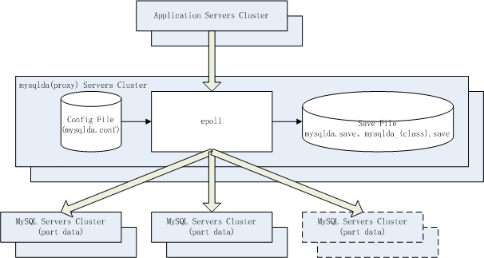

mysqlda - MySQL数据库中间件
==============================================

# 概述

mysqlda是一款基于核心业务对象切分的Proxy模式的MySQL数据库中间件。

分布式架构中最难解决的是数据分布式问题，大部分数据库中间件都以分库分表作为切分方式，好处是通用，但也存在以下问题：

1. 扩容过程需要以切片为单位在库间移动数据。扩容规模受到切片数量限制，如果业务发展增长规模大大超出初期预估会导致切片数量不够用，陷入数据硬迁移的困境。
1. 同一业务对象的数据分散在不同库中，无法做聚合、连接等复杂处理。
1. 跨库意味着分布式事务，虽然现在有两阶段提交等解决方案，但理论上并不总是那么可靠，尤其是在金融行业苛求数据强一致性。

核心业务对象切分方式则以产品线入口业务对象作为切分目标（比如互联网业务系统中的客户对象），开户交易途径数据库中间件，以手机号或其它入口字段作为核心字段做附带权重的客群切分，归属到数据库集群中的某个库中，并保存分配结果，以后该客户的所有交易都会被发往其归属库处理。当需要库存储扩容时，只需简单的增加库到数据库集群中，在数据库中间件系统中增加新库配置信息，并调大新库被分配权重，新客户分配归属到新库的概率变大，当新库存储增长到一定程度时调平分配权重，新客户分配归属到所有库的概率均等，直到下一次扩容。

核心业务对象切分方式的好处是：

1. 无需预估切片，其扩容过程无需移动任何数据。
1. 由于同一业务对象的数据集中在其归属库中，所以可以进行任意聚合、连接等复杂处理。
1. 每个库都是全业务库，同一业务对象的所有模块处理都在一个库中完成，不存在跨库分布式事务，数据强一致性丢还给数据库单库来保证。

但也存在以下硬伤：

1. 产品线设计初期慎重挑选核心业务对象作为切分依据，后期将很难变更。
1. 有些业务系统存在多个核心业务对象，不适合使用这种切分方式，如银行线上线下整合核心。

以分库分表切分 和 以核心业务对象切分 是两种主流的数据分布式设计范式，各有优缺点，应在不同场景挑选合适的方式。

# 体系架构

